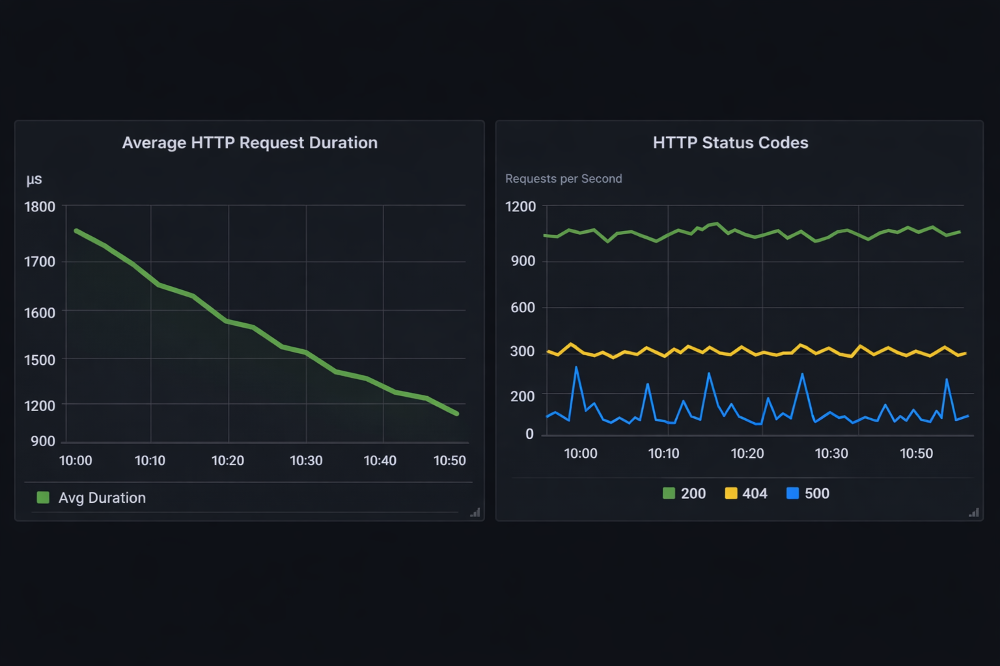

## Introduction
Kongi is a configurable HTTP (ingress) proxy designed with built in observability.

```markdown
## Usage

Ensure a configuration file (e.g., `config.yaml`) is present in the same directory.

The simplest configuration involves defining a proxy that forwards requests based on path and method.  Create a `config.yaml` file with the following content:

```yaml
port: 8080
metrics:
  path: /metrics
  port: 9090
paths:
  - path: /hello
    method: GET
    forwardPort: 8081
    maxRetry: 3
    timeout: 5s
```

This configuration sets up a proxy listening on port 8080.  It forwards GET requests to `/hello` to port 8081.  Metrics are exposed on `/metrics` at port 9090.

## Instructions 
- See [Makefile](./Makefile)

- Run `kongi` binary:
```bash
./bin/kongi
```

## Dashboards
